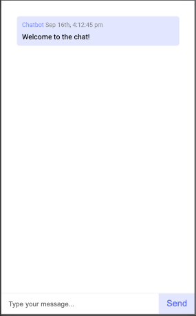

# react-chat

Realtime anonymous chat app with websockets using Node.js, Express and Socket.io



## Getting Started

#### To start the development server install all dependencies at the root and client folder

#### Once installed run the following to start the local dev environment

```
yarn dev
```

## Connecting to a shared chat

The chat uses query string parameters to connect to a shared chat.
To connect add params for **username** and **chatId** to the url where **chatId** is the shared instance of the chat

```
http://[BaseURL]/?username=McCracken&chatId=123456
```

## Tooling

Technologies used to scaffold this page:

- [React](https://reactjs.org/)
- [Typescript](https://www.typescriptlang.org/)
- [Styled Components](https://styled-components.com/)
- [Webpack](https://webpack.js.org/)
- [Prettier](https://prettier.io/)
- [RTL/Jest](https://jestjs.io/)
