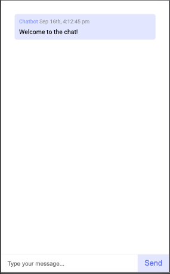

# react-chat

Realtime chat app with websockets using Node.js, Express and Socket.io



## Getting Started

```
npm install
npm run dev

Go to localhost:3000
```

## Tooling

Technologies used to scaffold this page:

- [React](https://reactjs.org/)
- [Typescript](https://www.typescriptlang.org/)
- [Styled Components](https://styled-components.com/)
- [Webpack](https://webpack.js.org/)
- [Prettier](https://prettier.io/)
- [Jest](https://jestjs.io/)
